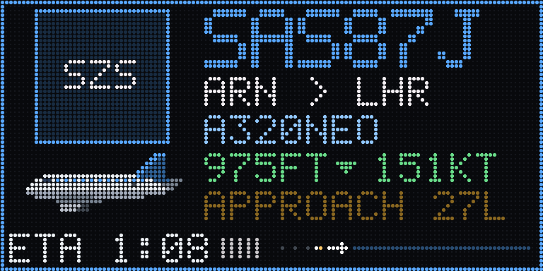

# Glideslope

A 128×64 LED flight board for planes landing at Heathrow. It picks the next
aircraft on final approach, flies it onto the panel, counts it down to the
runway threshold and plays a touchdown animation when it lands.



| New aircraft flies in | Touchdown |
| --- | --- |
|  |  |

All images are recorded from the board's own frames. The airline logo tile shows
the code (`SZS`) because logos are not part of this repository; see below.

## What it shows

- **Approach card**: airline logo, flight number (BA757A, mapped from the call
  sign), route cross-fading with the airline name, aircraft type with a
  matching side-profile sprite, smoothly counting altitude and speed,
  `APPROACH 27L` and an ETA countdown, and a progress strip to the threshold
  with approach lights running along it. The border takes the airline's
  colour. After touchdown: `LANDED 06:58` and the runway (or minutes
  early/late with an AeroAPI key).
- **Fly-across**: when a new aircraft arrives, its sprite crosses the panel in
  the direction it is really flying, climbing or descending with its real
  vertical rate. The old card stays ahead of it and the new one is revealed
  behind it.
- **Landing**: when the aircraft reaches the threshold it flares, touches down
  with tyre smoke and rolls out in front of a London skyline (with the Shard's
  warning light blinking); the card then reads `LANDED 27L`.
- **Landing traffic first**: aircraft lined up on a Heathrow runway are picked
  ahead of everything else, closest to touchdown first, and a card on final is
  held until its landing has played.
- **London map** between approaches: the Thames, reservoirs, M25 and
  Heathrow's runways (pre-rendered into flash), with every tracked aircraft as
  a dot in its airline colour trailing a dotted track; the one on final
  blinks. A home marker can be set in the web page.
- **Rare spots**: an A380, 747, An-124, military traffic or any type not seen
  before gets a gold banner before it flies in (seen types are logged on the
  board).
- **Today's stats** between map views: arrivals, busiest airline, rarest type.
- **Runway in use**, e.g. `27L UNTIL 15:00` (westerly ops alternate at 15:00).
- **Quiet hours**: a dim clock overnight when there's no traffic.
- **Board button** cycles Auto / Map / Stats.
- **Scanning screen** when nothing is being tracked.

  
- **Web page** on the board: a live mirror of the panel, animation previews,
  brightness, night dimming (UK time, GMT/BST automatic), location and data
  source settings, a log and a health endpoint.

Nine aircraft sprites are chosen by ICAO type code: narrowbody, widebody twin,
A380, 747, regional jet, turboprop, business jet, helicopter and light aircraft.
Unknown types fall back to a grey narrowbody.


## Hardware

| Part | Notes |
| --- | --- |
| Huidu HD-WF2 controller | ESP32-S3, 8 MB flash (DIO), no PSRAM. Panel on HUB75 port X1. |
| 128×64 HUB75 panel | Tested with a P2.5 (320×160 mm), 1/32 scan. |
| 5 V supply | Powers the board and panel. The board's USB-A port does **not** power it. |
| USB-A to USB-C data cable | For flashing. Many cables are charge-only. |

Other ESP32 boards with a HUB75 panel should work through the original
`esp32dev` environment, but only the HD-WF2 is tested.

## Getting started

1. Install [PlatformIO](https://platformio.org/) (`pip install platformio`).
2. Copy the example config files and fill in what you need. All of them can
   also be set later from the web page.

   ```bash
   cd firmware/config
   cp UserConfiguration.h.example UserConfiguration.h
   cp APIConfiguration.h.example APIConfiguration.h
   ```

3. **First flash only**: put the HD-WF2 into download mode. With the 5 V supply
   unplugged and USB connected, bridge the two holes on the left edge of the
   module, the round one (GND) and the square one (GPIO0), then plug in the
   5 V. Keep metal away from the 4-pin header below them; its pin by the
   triangle is 5 V. The test button on the board is not a boot button.
4. Build and flash from `firmware/`:

   ```bash
   pio run -e hd_wf2 -t upload
   pio run -e hd_wf2 -t uploadfs
   ```

   After the first flash, uploads work over USB without the bridge.
5. Join the `Glideslope-Setup` Wi-Fi network and enter your home Wi-Fi.
6. Open the board's address in a browser and enter your OpenSky API client ID
   and secret (free from your account page at
   [opensky-network.org](https://opensky-network.org/)).

## Airline logos

Logos are **not included**: they are the airlines' trademarks. Put your own
PNGs, named by ICAO airline code (`BAW.png`, `VIR.png`, ...), in `logos_input/`
and convert them to the board's 32×32 RGB565 format:

```bash
python tools/build_logos_local.py
pio run -e hd_wf2 -t uploadfs
```

Without a logo, the card shows a tile in a default colour with the airline code.

## Other airports

The approach logic is Heathrow-specific: runway thresholds live in
`firmware/display/ApproachModel.cpp`. Replace them with your airport's thresholds
and courses, and change `LHR` in the labels.

## Editing sprites

Sprites are text grids in `tools/sprite_workbench.py`. Run it to render a
preview image and print the C arrays for `firmware/display/AircraftSprites.cpp`.
The landing scene's London skyline is generated the same way by
`tools/skyline_workbench.py`.

## Data sources

- [OpenSky Network](https://opensky-network.org/) for aircraft positions
  (or a local [tar1090](https://github.com/wiedehopf/tar1090) receiver).
- [hexdb.io](https://hexdb.io/) for routes, registrations and aircraft types.
- FlightAware AeroAPI, optional and paid.

## Credits and licence

Glideslope builds on
[TheFlightWall_OSS](https://github.com/AxisNimble/TheFlightWall_OSS) and the
forks by biohead and [peterdaley](https://github.com/peterdaley/TheFlightWall_OSS),
and uses [ESP32-HUB75-MatrixPanel-DMA](https://github.com/mrcodetastic/ESP32-HUB75-MatrixPanel-DMA).
See [NOTICE](NOTICE) for what changed.

Not affiliated with or endorsed by TheFlightWall or any airline.

Licensed under the [Apache License 2.0](LICENSE).
