<p align="center">
  
</p>

<p align="center">
  <b>An LED flight board for the planes landing over your house.</b><br>
  Live ADS-B on a 128×64 LED panel: each arrival flies in, counts down to the
  runway and lands; departures take off; between them, a map, an arrivals
  board and the weather.
</p>

<p align="center">
  <a href="https://github.com/SamHoughton/Glideslope/releases/latest"></a>
  <a href="https://github.com/SamHoughton/Glideslope/actions/workflows/build.yml"></a>
  <a href="LICENSE"></a>
  
</p>

<p align="center">
  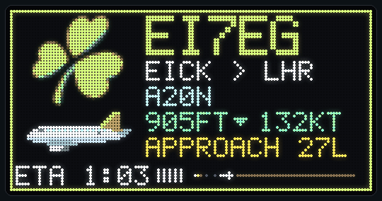
</p>

Recorded from the board's own frames with its built-in showcase (the
fictional flight GS101, in Glideslope's colours). Real cards carry the
airline's logo, which you supply yourself: logos are not part of this
repository (see [Airline logos](#airline-logos)).

| New aircraft flies in | Touchdown |
| --- | --- |
| 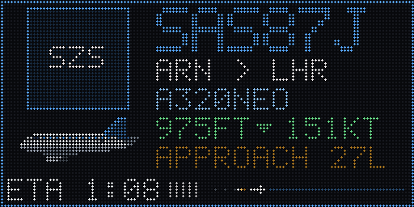 | 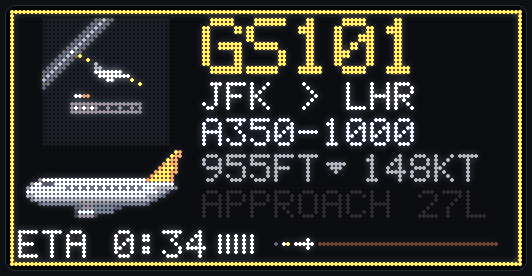 |

| Take-off | Arrivals board |
| --- | --- |
| 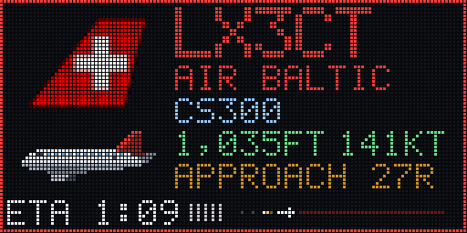 | 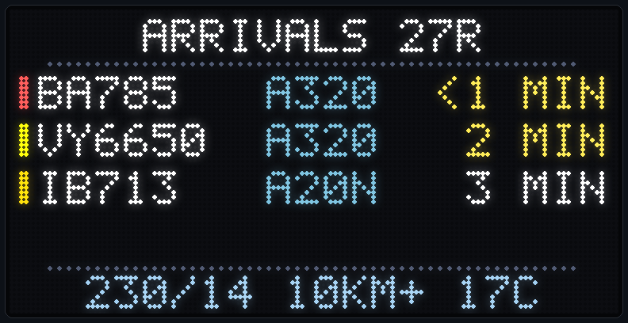 |

| Weather | Emergency squawk |
| --- | --- |
| 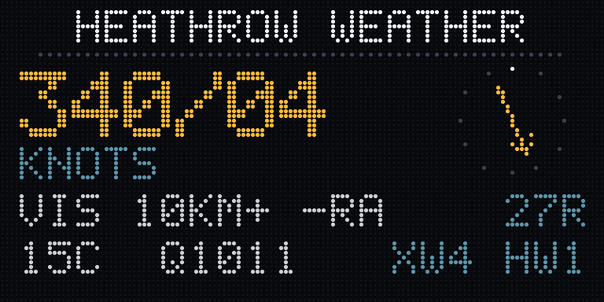 | 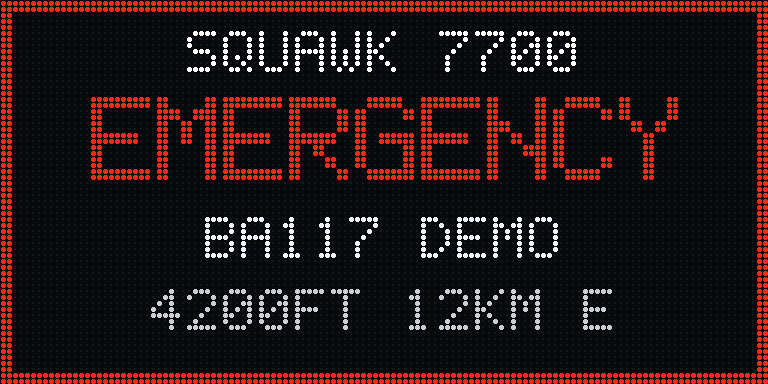 |

### The web page

Every board serves a page at `http://glideslope.local/`: a live mirror of the
panel, the animations on demand, every setting, firmware updates and a log.

| Desktop | Phone |
| --- | --- |
| 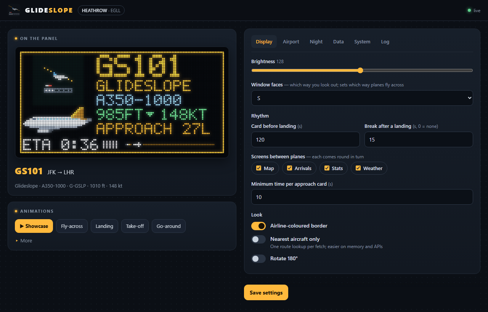 | 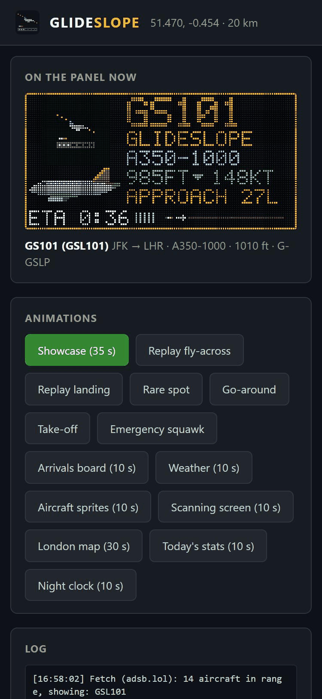 |

## What it shows

- **Approach card**: airline logo, flight number (BA757A, mapped from the call
  sign), route cross-fading with the airline name, aircraft type with a
  matching side-profile sprite, smoothly counting altitude and speed,
  `APPROACH 27L` and an ETA countdown, and a progress strip to the threshold
  with approach lights running along it. The border takes the airline's
  colour. After touchdown: `LANDED 06:58` and the runway (or minutes
  early/late with an AeroAPI key).
- **Fly-across**: when a new aircraft arrives, its sprite crosses the panel in
  the direction it is really flying, climbing or descending with its real
  vertical rate. The old card stays ahead of it and the new one is revealed
  behind it.
- **Landing**: when the aircraft reaches the threshold it flares, touches down
  with tyre smoke and rolls out in front of a London skyline (with the Shard's
  warning light blinking); the card then reads `LANDED 27L`. It only plays
  once the aircraft is really down: low, level and at the threshold.
- **Go-arounds**: an aircraft on final that climbs away instead of landing
  gets its own scene and a flashing `GO AROUND 27L` card, and is counted on
  the stats screen.
- **Take-offs**: a Heathrow departure that has just left the ground gets the
  same skyline scene the other way round: it rolls, rotates and climbs out
  under `DEPARTED 27R` and `BA117 TO JFK`.
- **Emergency squawks**: an aircraft in range squawking 7700 (emergency),
  7600 (radio failure) or 7500 (hijack) takes over the panel for a few seconds
  with a flashing red alert, and shows red on the map. It must be seen in two
  fetches running, so a single garbled reply doesn't trigger it.
- **The rhythm**: between planes the board rotates through its screens (map,
  arrivals, stats, weather). A plane's card is the event: an approach flies in
  about two minutes before touchdown and stays until it has landed; a
  departure or overflight gets a short card. After every landing comes a
  15-second break showing the next screen in the rotation, so they all come
  round even at a busy Heathrow (skipped if the next plane is under 45
  seconds out). Lead time, break length and which screens rotate are set on
  the web page.
- **London map**: the Thames, reservoirs, M25 and
  Heathrow's runways (pre-rendered into flash), with every tracked aircraft as
  a small plane icon pointing the way it is flying, in its airline colour; the
  one on final blinks. A home marker can be set in the web page.
- **Arrivals board**: the next four arrivals with their type and
  minutes to touchdown (`~` while still a rough guess, before they join
  final), and Heathrow's weather along the bottom, e.g. `310/04 7KM RA 14C`
  (wind, visibility, rain, temperature).
- **Rare spots**: an A380, 747, An-124, military traffic or any type not seen
  before gets a gold banner before it flies in (seen types are logged on the
  board).
- **Today's stats**: big arrival and departure counters, an hourly bar chart
  of the day's movements, and the busiest airline, rarest type and
  go-arounds in turn. Every aircraft in range counts (an arrival once it is
  on final, a departure once it climbs out along a runway), not only the
  ones that get a card, and the tally is saved so a restart keeps the day.
  It only sees what is in range: centre the search near the airport (or
  make the radius large enough to cover both approaches) to count every
  movement.
- **Weather**: Heathrow's wind (with a compass arrow), gusts, visibility,
  weather, temperature, pressure, and the crosswind and head- or tailwind on
  the runway in use.
- **Runway in use**, e.g. `27L UNTIL 15:00` (westerly ops alternate at 15:00).
- **Quiet hours**: a dim clock (with the weather) overnight when there's no
  traffic.
- **Board button** cycles Auto / Map / Arrivals / Stats / Weather.
- **Scanning screen** when nothing is being tracked.

  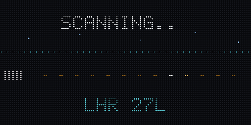
- **Showcase**: a 35-second scripted tour (the button on the web page) for
  showing the board off, and for recording the README demo with
  `tools/record_demo.py`.
- **Web page** on the board: a live mirror of the panel, animation previews,
  brightness, night dimming (UK time, GMT/BST automatic), location and data
  source settings, firmware updates over Wi-Fi, a log and a health endpoint.

Nine aircraft sprites are chosen by ICAO type code: narrowbody, widebody twin,
A380, 747, regional jet, turboprop, business jet, helicopter and light aircraft.
Unknown types fall back to a grey narrowbody.

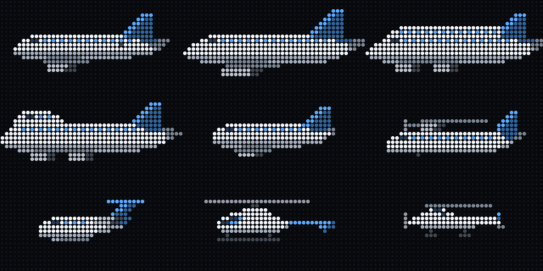

## Hardware

| Part | Notes |
| --- | --- |
| Huidu HD-WF2 controller | ESP32-S3, 8 MB flash (DIO), no PSRAM. Panel on HUB75 port X1. |
| 128×64 HUB75 panel | Tested with a P2.5 (320×160 mm), 1/32 scan. |
| 5 V supply | Powers the board and panel. The board's USB-A port does **not** power it. |
| USB-A to USB-C data cable | For flashing. Many cables are charge-only. |

Other ESP32 boards with a HUB75 panel should work through the original
`esp32dev` environment, but only the HD-WF2 is tested.

## Getting started

### Without building anything

The easiest way is the browser installer at
<https://samhoughton.github.io/Glideslope/> (Chrome or Edge): put the board
in download mode (step 3 below), press Install, then carry on from step 5.

Or by hand:

1. Download `glideslope-<version>-full.bin` from the latest
   [release](../../releases).
2. Put the board into download mode (step 3 below) and write the file at
   address `0x0`, either from Chrome or Edge with
   [esptool-js](https://espressif.github.io/esptool-js/) (Connect, then
   Program at flash address 0x0) or with
   `esptool --chip esp32s3 write-flash 0x0 glideslope-<version>-full.bin`.
3. Carry on from step 5 below.

### Building it yourself

1. Install [PlatformIO](https://platformio.org/) (`pip install platformio`).
2. Copy the example config files and fill in what you need. All of them can
   also be set later from the web page.

   ```bash
   cd firmware/config
   cp UserConfiguration.h.example UserConfiguration.h
   cp APIConfiguration.h.example APIConfiguration.h
   ```

3. **First flash only**: put the HD-WF2 into download mode. With the 5 V supply
   unplugged and USB connected, bridge the two holes on the left edge of the
   module, the round one (GND) and the square one (GPIO0), then plug in the
   5 V. Keep metal away from the 4-pin header below them; its pin by the
   triangle is 5 V. The test button on the board is not a boot button.
4. Build and flash from `firmware/`:

   ```bash
   pio run -e hd_wf2 -t upload
   pio run -e hd_wf2 -t uploadfs
   ```

   After the first flash, uploads work over USB without the bridge.

   If you flash `firmware.bin` with esptool by hand rather than with
   `pio ... -t upload`, also write `boot_app0.bin` at `0xe000` (PlatformIO
   does this for you); otherwise a board that was last updated over Wi-Fi
   keeps booting the older copy.
5. Join the `Glideslope-Setup` Wi-Fi network and enter your home Wi-Fi.
6. Open the board's address in a browser. Positions come from the community
   feeds out of the box; optionally add an OpenSky API client ID and secret
   (free from [opensky-network.org](https://opensky-network.org/)) as the
   last-resort backup.

## Updating

Open the board's web page, choose `firmware.bin` (from a
[release](../../releases), or `firmware/.pio/build/hd_wf2/firmware.bin` from
your own build) under **Firmware**, and press **Install update**. It takes
about 10 seconds and the board restarts into the new version; if anything
goes wrong the old one keeps running. The web page has no password, so this
is only safe on a network you trust (as is the rest of the page).

Releases are built by GitHub Actions: pushing a tag such as `v1.0.0` builds
the firmware and attaches `firmware.bin` and the full image to a release.

## Airline logos

Logos are **not included**: they are the airlines' trademarks. Put your own
PNGs, named by ICAO airline code (`BAW.png`, `VIR.png`, ...), in `logos_input/`
and convert them to the board's 32×32 RGB565 format:

```bash
python tools/build_logos_local.py
pio run -e hd_wf2 -t uploadfs
```

Without a logo, the card shows a tile in a default colour with the airline code.

## Other airports

The approach logic is Heathrow-specific: runway thresholds live in
`firmware/display/ApproachModel.cpp`. Replace them with your airport's thresholds
and courses, and change `LHR` in the labels.

## Brand

The logo, wordmark, favicon and social preview are drawn on an LED grid like
the panel, by `tools/brand_workbench.py` (`python tools/brand_workbench.py a`
for the marks, `social` for the preview card); the files are in `brand/`.
`tools/webui_preview.py` serves the board's web page on your computer with
sample data, for screenshots or for working on the page without a board.

## Editing sprites

Sprites are text grids in `tools/sprite_workbench.py`. Run it to render a
preview image and print the C arrays for `firmware/display/AircraftSprites.cpp`.
The landing scene's London skyline is generated the same way by
`tools/skyline_workbench.py`.

## Data sources

Aircraft positions, first to answer wins:

1. A local [tar1090](https://github.com/wiedehopf/tar1090) receiver, if set.
2. The open community feeds [adsb.lol](https://adsb.lol/) (ODbL) and
   [adsb.fi](https://adsb.fi/), polled every 5 s; positions are usually
   under a second old. adsb.lol is asked first, over plain HTTP (it is open
   data, and skipping a TLS handshake every few seconds leaves the board
   more memory); adsb.fi takes over while adsb.lol rests for a minute after
   a rate-limit reply. Can be switched off in the settings.
3. [OpenSky Network](https://opensky-network.org/), every 30 s.

- [hexdb.io](https://hexdb.io/) for routes, registrations and aircraft types.
- [aviationweather.gov](https://aviationweather.gov/) (NOAA) for Heathrow's
  METAR, every 10 minutes.
- FlightAware AeroAPI, optional and paid.

## Credits and licence

Glideslope builds on
[TheFlightWall_OSS](https://github.com/AxisNimble/TheFlightWall_OSS) and the
forks by biohead and [peterdaley](https://github.com/peterdaley/TheFlightWall_OSS),
and uses [ESP32-HUB75-MatrixPanel-DMA](https://github.com/mrcodetastic/ESP32-HUB75-MatrixPanel-DMA).
See [NOTICE](NOTICE) for what changed.

Not affiliated with or endorsed by TheFlightWall or any airline.

Licensed under the [Apache License 2.0](LICENSE).
