# Airport packs

Ready-made packs for Glideslope. On the board's web page, under **Airport**, pick one
from the list (or download a `.airport` file here and choose it). Heathrow is built in.

Rebuild or add airports with `python tools/build_packs.py` (list: `airports.txt`).

Runways: [OurAirports](https://ourairports.com/data/) (public domain).
Maps: © [OpenStreetMap](https://www.openstreetmap.org/copyright) contributors.

| Airport | Map |
| --- | --- |
| **BIRMINGHAM** (EGBB/BHX) Birmingham, West Midlands, GB [EGBB.airport](EGBB.airport) | 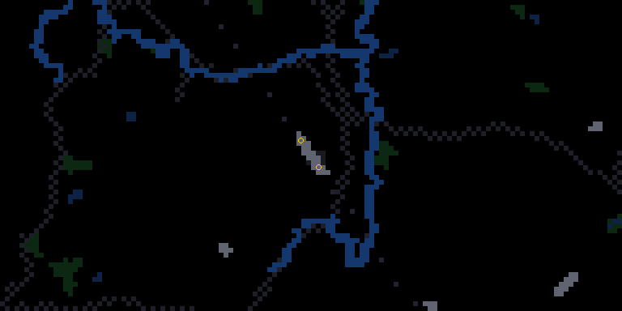 |
| **BRISTOL** (EGGD/BRS) Bristol, GB [EGGD.airport](EGGD.airport) | 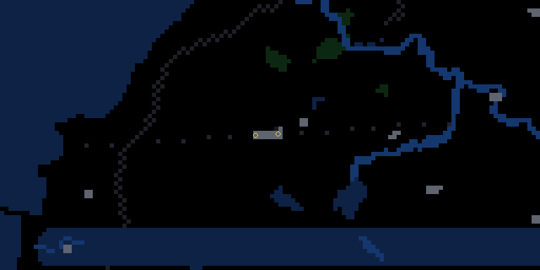 |
| **EDINBURGH** (EGPH/EDI) Ingliston, Edinburgh, GB [EGPH.airport](EGPH.airport) | 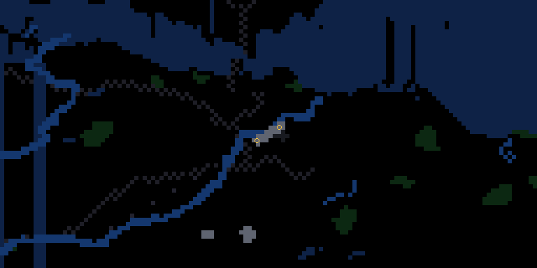 |
| **GATWICK** (EGKK/LGW) London, GB [EGKK.airport](EGKK.airport) | 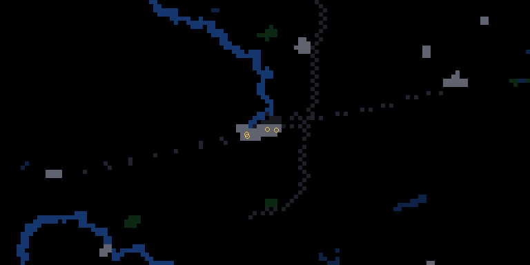 |
| **GLASGOW** (EGPF/GLA) Glasgow, GB [EGPF.airport](EGPF.airport) | 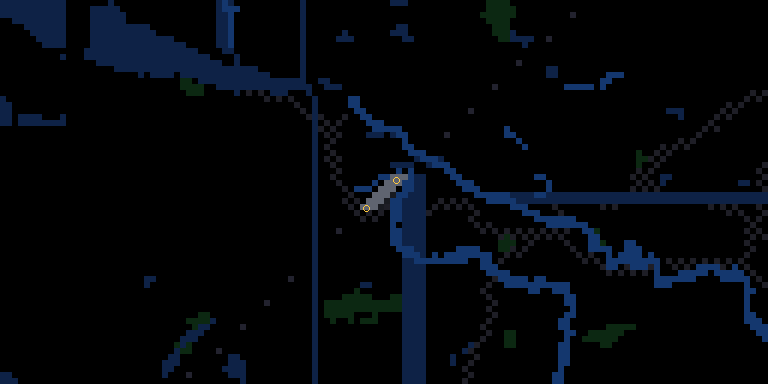 |
| **LONDON LUTON** (EGGW/LTN) Luton, Luton, GB [EGGW.airport](EGGW.airport) | 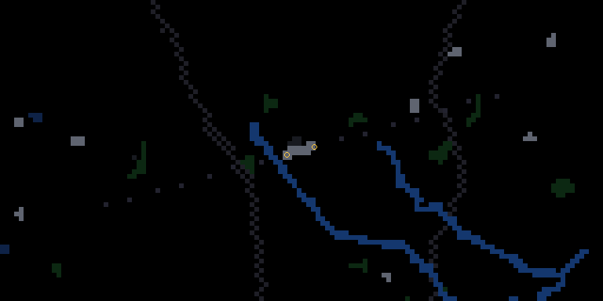 |
| **LONDON STANSTED** (EGSS/STN) London, Essex, GB [EGSS.airport](EGSS.airport) | 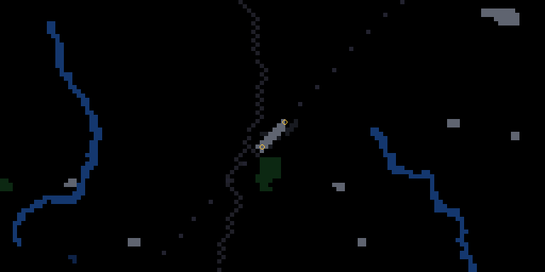 |
| **TORONTO** (CYYZ/YYZ) Toronto, CA [CYYZ.airport](CYYZ.airport) | 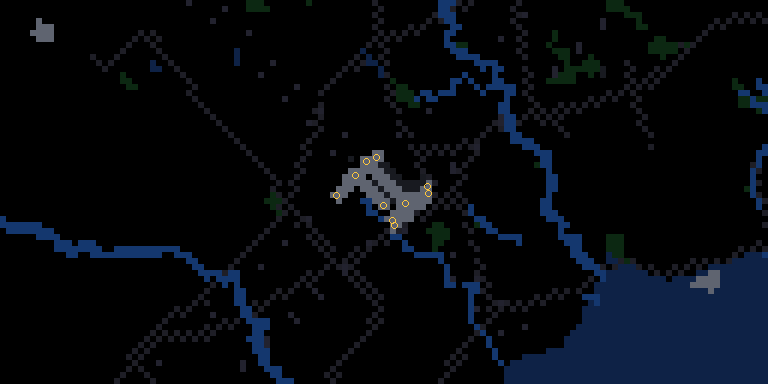 |
| **ZURICH** (LSZH/ZRH) Zurich, CH [LSZH.airport](LSZH.airport) | 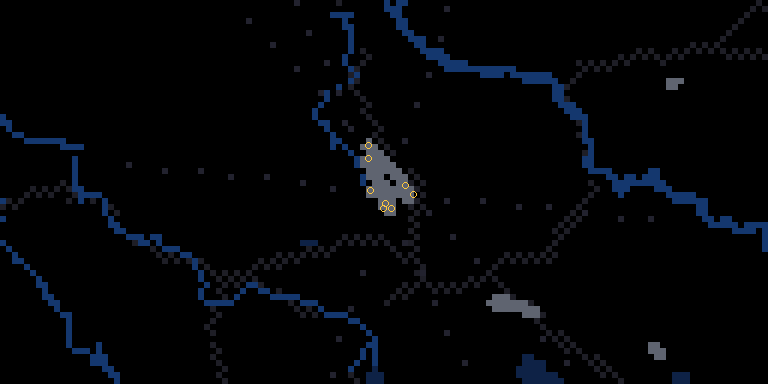 |
| **BERLIN** (EDDB/BER) Berlin, DE [EDDB.airport](EDDB.airport) | 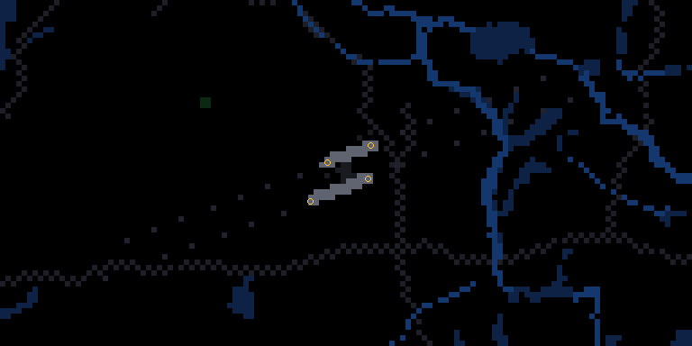 |
| **MUNICH** (EDDM/MUC) Munich, DE [EDDM.airport](EDDM.airport) | 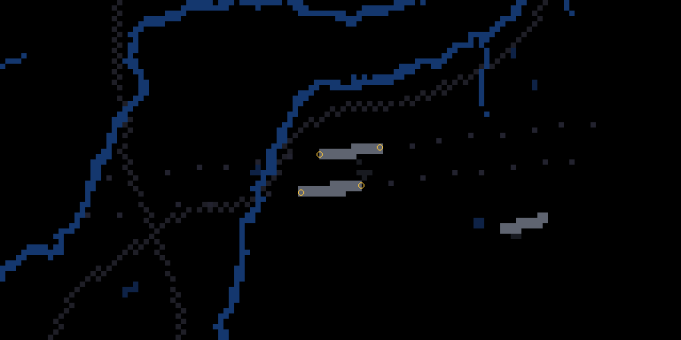 |
| **COPENHAGEN** (EKCH/CPH) Copenhagen, DK [EKCH.airport](EKCH.airport) | 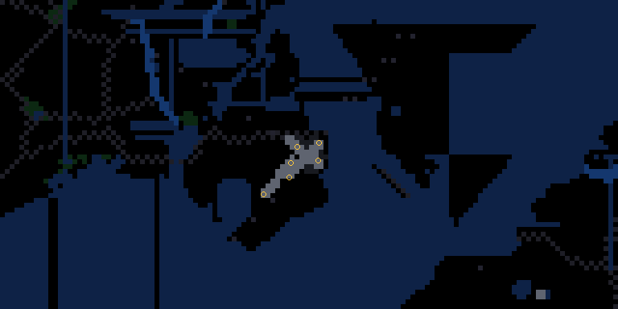 |
| **BARCELONA** (LEBL/BCN) Barcelona, ES [LEBL.airport](LEBL.airport) | 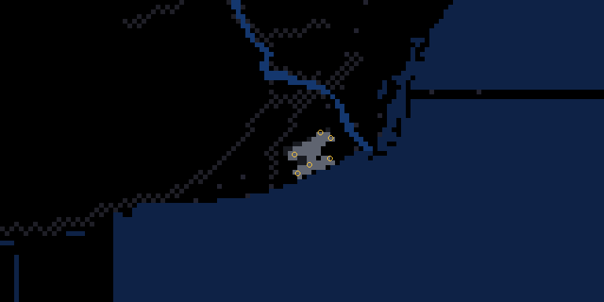 |
| **CHARLES DE GAULL** (LFPG/CDG) Paris (Roissy-en-France, Val-d'Oise), FR [LFPG.airport](LFPG.airport) | 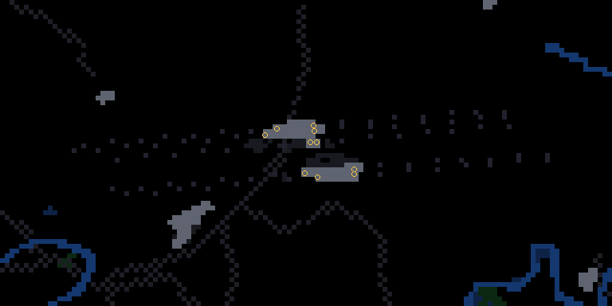 |
| **ORLY** (LFPO/ORY) Paris (Orly, Val-de-Marne), FR [LFPO.airport](LFPO.airport) | 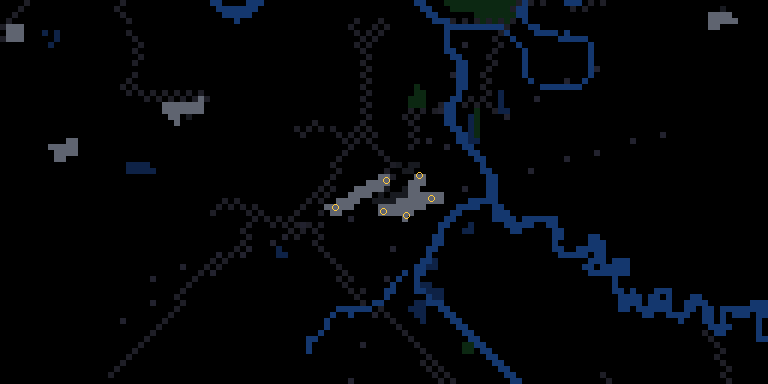 |
| **DUBLIN** (EIDW/DUB) Dublin, IE [EIDW.airport](EIDW.airport) | 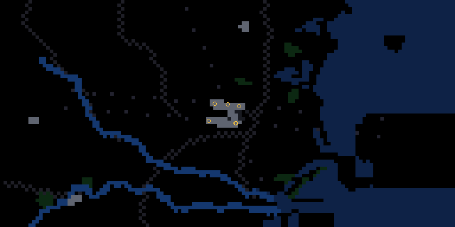 |
| **FIUMICINO** (LIRF/FCO) Rome, IT [LIRF.airport](LIRF.airport) | 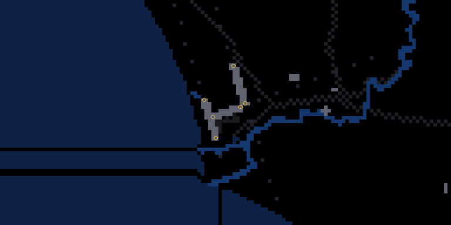 |
| **SCHIPHOL** (EHAM/AMS) Amsterdam, NL [EHAM.airport](EHAM.airport) | 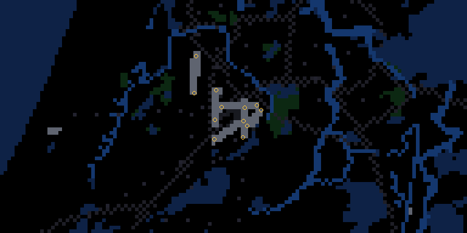 |
| **AUCKLAND** (NZAA/AKL) Auckland, NZ [NZAA.airport](NZAA.airport) | 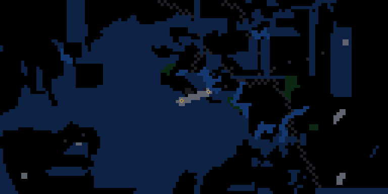 |
| **LISBON** (LPPT/LIS) Lisbon, PT [LPPT.airport](LPPT.airport) | 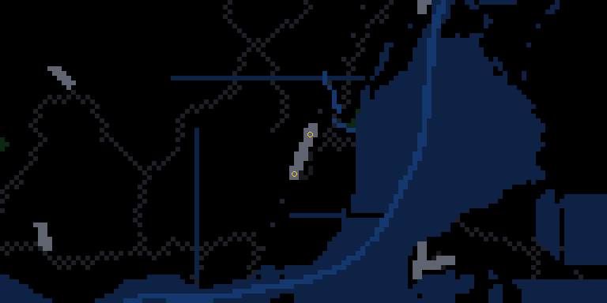 |
| **CHANGI** (WSSS/SIN) Singapore, SG [WSSS.airport](WSSS.airport) | 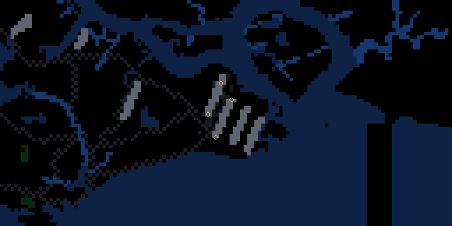 |
| **ISTANBUL** (LTFM/IST) Istanbul, TR [LTFM.airport](LTFM.airport) | 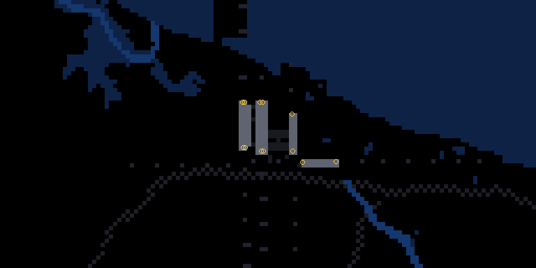 |
| **ATLANTA** (KATL/ATL) Atlanta, US [KATL.airport](KATL.airport) | 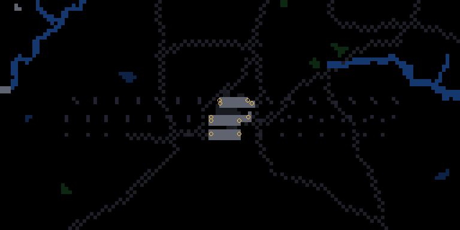 |
| **BOSTON** (KBOS/BOS) Boston, US [KBOS.airport](KBOS.airport) | 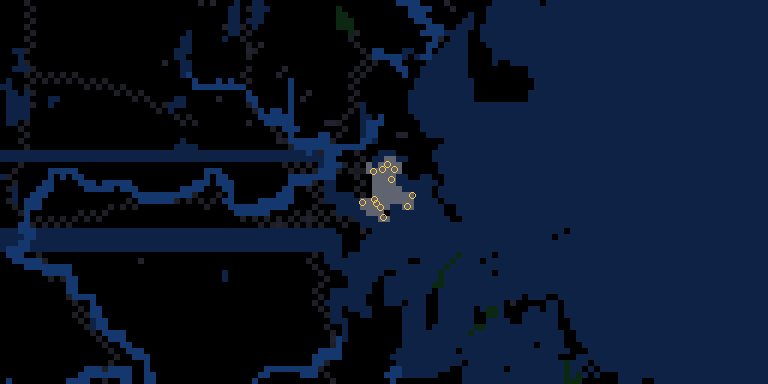 |
| **DALLAS FT WORTH** (KDFW/DFW) Dallas-Fort Worth, US [KDFW.airport](KDFW.airport) | 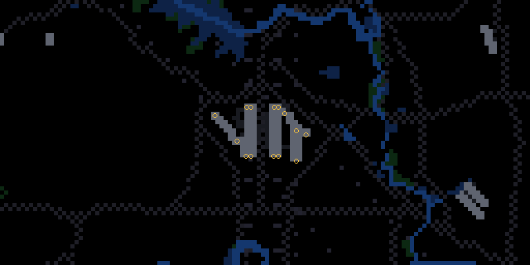 |
| **DENVER** (KDEN/DEN) Denver, US [KDEN.airport](KDEN.airport) | 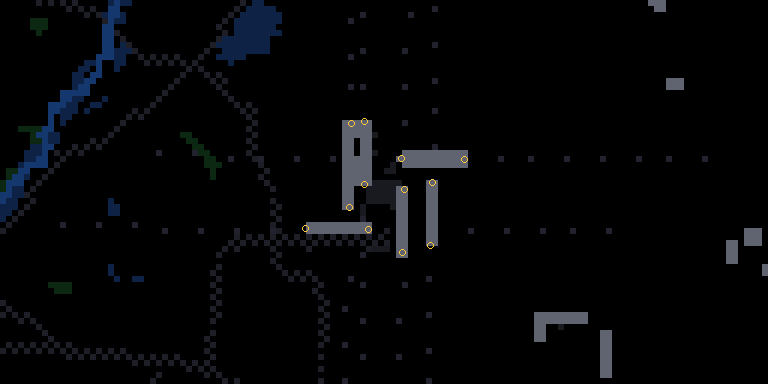 |
| **SAN FRANCISCO** (KSFO/SFO) San Francisco, US [KSFO.airport](KSFO.airport) | 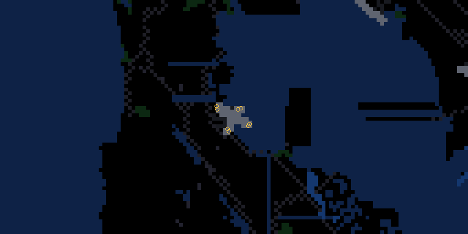 |
| **SEATTLE** (KSEA/SEA) Seattle, US [KSEA.airport](KSEA.airport) | 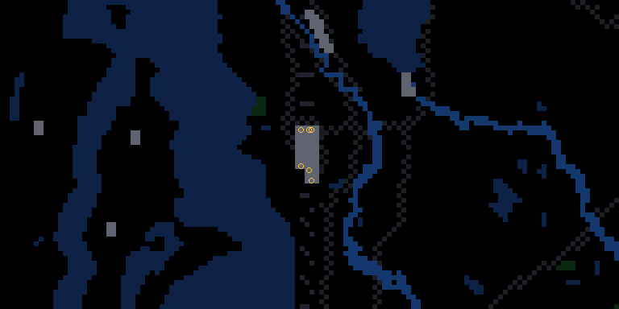 |
